# LEGALTRACK — Database Entity-Relationship (ER) Diagram

This document presents the relational structure and key entity relationships of the **LEGALTRACK** database schema (`legaltrack`).

```mermaid
erDiagram
    users ||--o| client_profiles : "has"
    users ||--o| lawyer_profiles : "has"
    users ||--o{ user_roles : "assigned"
    roles ||--o{ user_roles : "belongs to"
    users ||--o{ refresh_tokens : "owns"

    states ||--o{ districts : "contains"
    districts ||--o{ court_complexes : "contains"
    court_complexes ||--o{ courts : "contains"
    districts ||--o{ police_stations : "contains"

    lawyer_profiles ||--|| lawyer_availability : "maintains"
    lawyer_profiles ||--o{ lawyer_specializations : "possesses"
    lawyer_profiles ||--o{ lawyer_courts : "practices in"
    lawyer_profiles ||--o{ lawyer_languages : "speaks"
    lawyer_profiles ||--o| lawyer_verifications : "undergoes"

    users ||--o{ cases : "participates (client/lawyer)"
    courts ||--o{ cases : "hears"
    cases ||--o{ case_parties : "involves"
    cases ||--o{ case_advocates : "represented by"
    cases ||--o{ case_events : "chronicles (timeline)"
    cases ||--o{ case_diary_entries : "logs (diary)"
    cases ||--o{ case_hearings : "schedules"
    cases ||--o{ case_orders : "receives"
    cases ||--o{ case_documents : "contains"
    cases ||--o{ case_notes : "annotates"
    cases ||--o{ case_attention : "requires attention"

    users ||--o{ tracked_cases : "tracks"
    cases ||--o{ tracked_cases : "is tracked by"

    users ||--o{ lawyer_requests : "sends/receives"
    users ||--o{ client_lawyer_relationships : "forms"

    users ||--o{ legal_aid_applications : "applies/assigned"
    legal_aid_applications ||--o{ legal_aid_documents : "attaches"
    legal_aid_applications ||--o{ legal_aid_status_history : "tracks changes"
    legal_aid_applications ||--o| legal_aid_assignments : "results in"

    conversations ||--o{ messages : "contains"
    users ||--o{ conversations : "participates in"
    users ||--o{ notifications : "receives"
    users ||--o{ support_tickets : "files"
    support_tickets ||--o{ support_messages : "threads"
    users ||--o{ audit_logs : "triggers"
    cases ||--o{ case_sync_logs : "records sync"
```

## Summary of Core Tables

| Table | Description | Primary Key | Key Foreign Keys |
| :--- | :--- | :--- | :--- |
| `users` | System user credentials, status, contact details | `id` (BIGINT) | - |
| `roles` | System roles (CLIENT, LAWYER, ADMIN, LEGAL_AID_OFFICER, SUPPORT) | `id` (BIGINT) | - |
| `lawyer_profiles` | Bar council registration, experience, bio, verification | `id` (BIGINT) | `user_id`, `state_id`, `district_id` |
| `lawyer_availability`| Lawyer acceptance status & availability dates | `id` (BIGINT) | `lawyer_id` |
| `cases` | Case files, CNR, Case Number, FIR, Court, Status, Stage | `id` (BIGINT) | `client_id`, `lawyer_id`, `court_id` |
| `tracked_cases` | User-case tracking relation with notification toggle | `id` (BIGINT) | `user_id`, `case_id` |
| `case_events` | Formal timeline events (e.g. Filed, Registered, Summons) | `id` (BIGINT) | `case_id`, `created_by` |
| `case_diary_entries`| Chronological activity feed with visibility controls | `id` (BIGINT) | `case_id`, `created_by` |
| `case_attention`| Automated administrative alerts & action items | `id` (BIGINT) | `case_id` |
| `case_hearings` | Scheduled, adjourned, and completed court hearings | `id` (BIGINT) | `case_id`, `court_id` |
| `case_orders` | Court orders, decrees, and interim directions | `id` (BIGINT) | `case_id` |
| `case_documents`| Versioned legal documents with checksum and access checks | `id` (BIGINT) | `case_id`, `uploaded_by` |
| `legal_aid_applications` | Legal aid pre-check, application data, verification status | `id` (BIGINT) | `client_id`, `assigned_lawyer_id` |
| `conversations` | 1-to-1 client-lawyer chat channels | `id` (BIGINT) | `client_id`, `lawyer_id`, `case_id` |
| `notifications` | System & event notifications with read states | `id` (BIGINT) | `user_id` |
| `audit_logs` | Immutable audit trail for compliance & access tracking | `id` (BIGINT) | `actor_user_id` |
| `case_sync_logs`| Mock / court synchronization execution history | `id` (BIGINT) | `case_id` |
