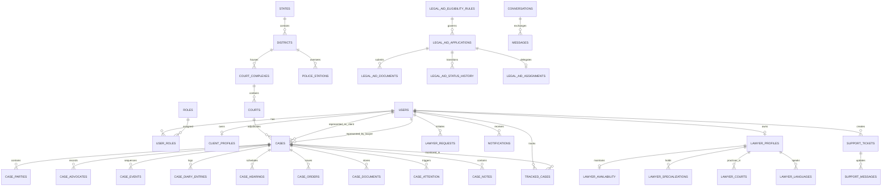

# LEGALTRACK — Database Entity Relationship (ER) Diagram

This document models the relational schema for the **LEGALTRACK** legal management and case tracking portal.

## Relational Invariants & Integrity Constraints

1. **User Isolation**: A user must have exactly one specific role profile (`ClientProfile` or `LawyerProfile`).
2. **Case Uniqueness**: A `(user_id, case_id)` pair in `tracked_cases` is unique to prevent duplicate case tracking entries.
3. **Optimistic Locking**: Key mutable entities (`CaseFile`, `LegalAidApplication`, `LawyerRequest`, `CaseDocument`) utilize version counters to prevent concurrent update anomalies.
4. **Visibility Level Isolation**: `CaseDiaryEntry`, `CaseDocument`, and `CaseNote` utilize explicit visibility enums (`SHARED`, `LAWYER_ONLY`, `CLIENT_PRIVATE`, `ADMIN_ONLY`) enforced at service and query boundaries.
