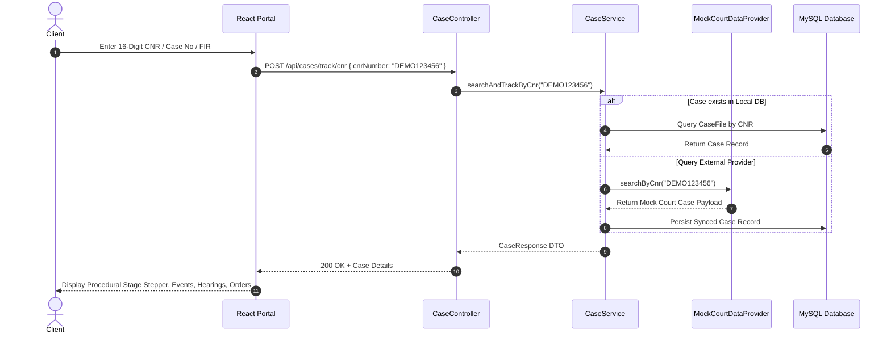
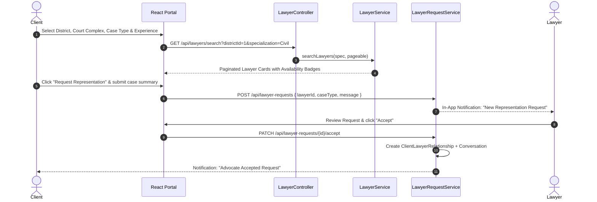
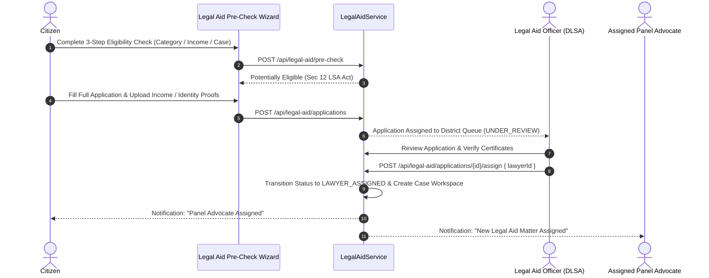
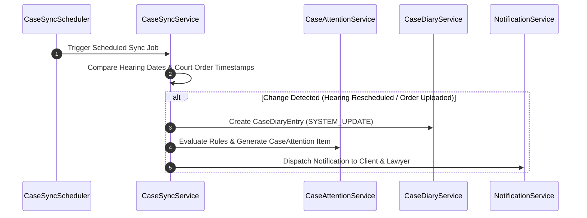

# LEGALTRACK — Core System Workflows & User Journeys

This document outlines the end-to-end procedural workflows implemented in **LEGALTRACK**.

---

## 1. Universal Case Tracking Workflow

---

## 2. Advocate Discovery & Engagement Workflow

---

## 3. Statutory Legal Aid Application Workflow

---

## 4. Case Attention Rule Engine & Sync Flow

